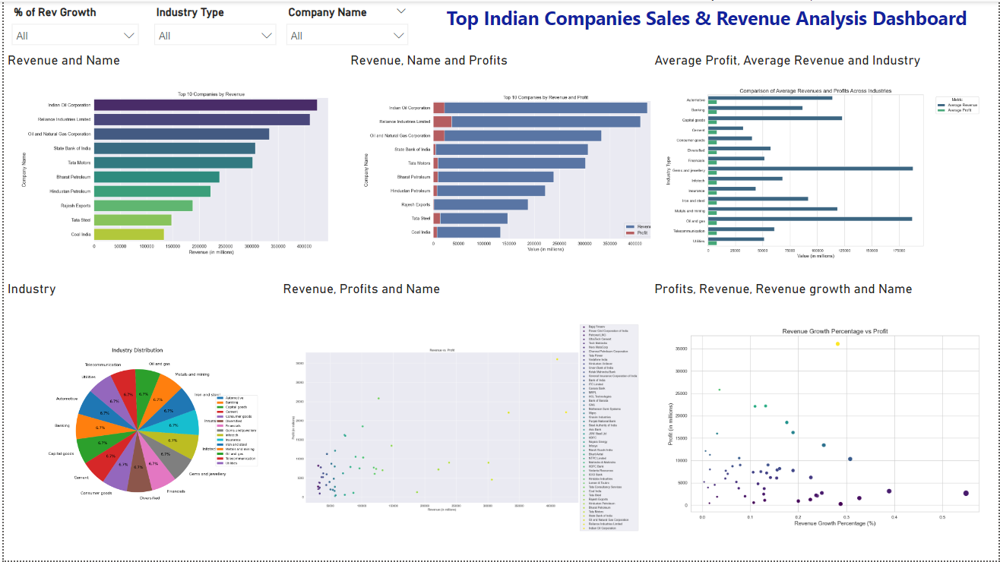
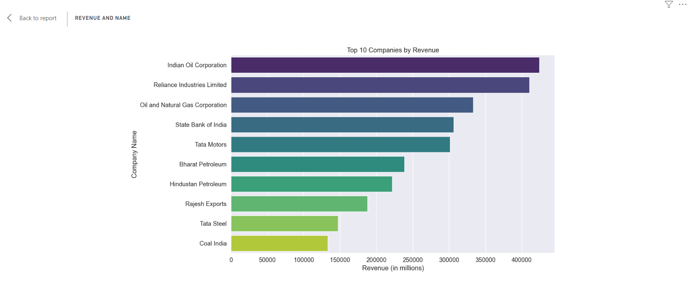
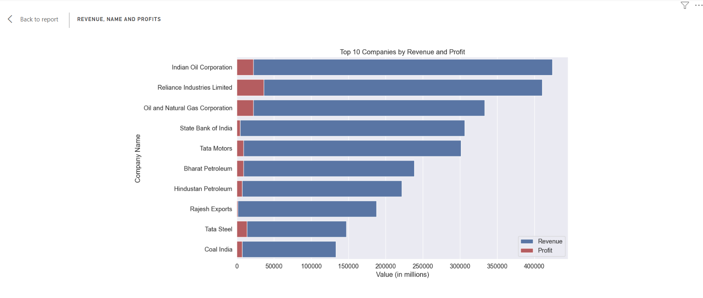
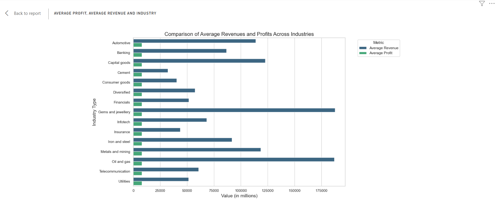
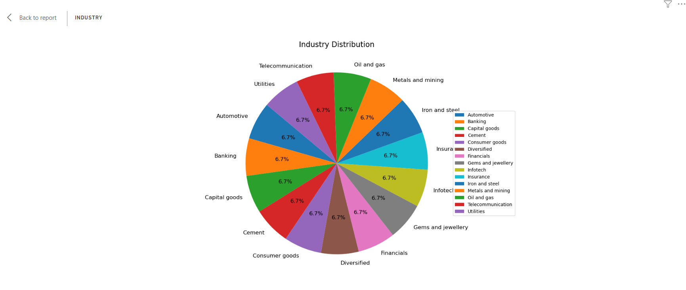
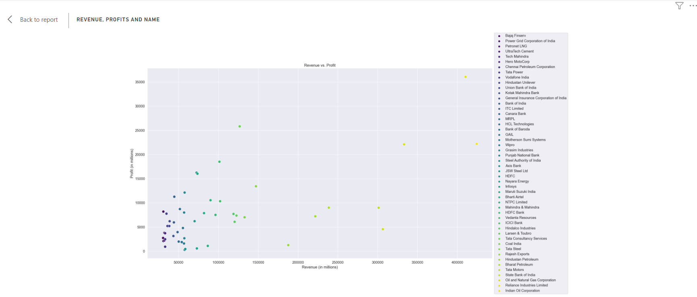
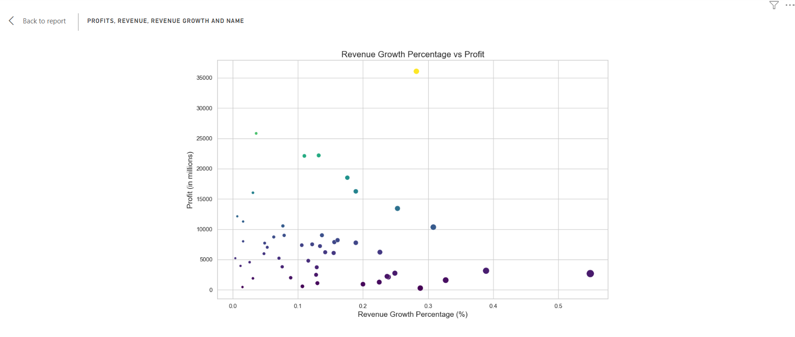

# Top Indian Companies Sales & Revenue Analysis

## Overview
This project focuses on analyzing the sales and revenue data of top Indian companies using Python and Power BI. The goal is to provide a comprehensive dashboard that visualizes key metrics and trends, enabling better business decision-making. The project includes data import, cleaning, and preparation, followed by visualization creation using Python libraries and Power BI.
## Project Structure & Task

1. Import Data into Power BI

2. Data Cleaning and Preparation: 

3. Visualization Creation Using Python and Power BI

4.  Interactive Dashboard Elements

5.  Make Analysis Recommendations

## Data & Resource Used

**Dataset**

Option 1: [Kaggle](https://www.kaggle.com/datasets?fileType=csv)

**Tools and Technologies** 

•	Power BI Function Library: DAX

•	Programming Language & Library: Python, matplotlib, and seaborn

•	Tool: Microsoft Excel, SQL Server, and Power BI

## Data Visualization & Key Findings
### 1. Top 10 Companies Analysis
**Insight:** The oil and gas industry stands out as the leading sector, generating the maximum revenue and profit compared to other industries. This highlights the sector's dominance and significance in the Indian market.

### 2. Top 10 Companies by Revenue & Profit

**Insight:** The oil and gas industry stands out as the leading sector, generating the maximum revenue and profit compared to other industries. 

### 3. Comparison of Average Revenue & Profit across by Industries

**Insight:** We can clearly notice that Gems and jewellery industry, Oil and gas industry, and Capital goods industry are placed in Top 3 of Average Revenue but for all industry have same average profit range.

### 4. Industry Distribution

**Insight:** The average distribution of companies across various industries is approximately 6.7%. This metric provides an understanding of market diversity and concentration in different sectors.

### 4. Revenue vs Profit by Company Name

**Insight:** We can see that very few companies only exit to maximum revenue and profit.

### 5. Revenue Growth % vs. Profit:

**Insight:** o	Most data points fall within the range of 0.3% to 25,000 in profit, indicating a standard growth pattern among the companies analyzed. Only a few outliers exceed this range, suggesting exceptional performance or specific circumstances.

## Data Analysis & Key Takeaways
A. **Industry Dominance:** The oil and gas sector emerged as a dominant industry, generating the highest revenue and profit. This indicates strong market positioning and potential growth opportunities within this sector.

B. **Market Diversity:** The industry distribution analysis revealed an average company distribution of approximately 6.7% across various industries, suggesting a relatively balanced market with opportunities for diversification.

C. **Growth and Profit Correlation:** The scatter plot analysis between profit and revenue growth percentage highlighted that most companies are within a standard growth range, with a few outliers demonstrating exceptional performance.

D. **Data-Driven Decision Making:** The interactive dashboard, equipped with various slicers and dynamic visualizations, enables stakeholders to explore data in detail. This feature allows for a more nuanced understanding of specific segments, aiding in data-driven decision-making.

## Conclusion
The "Top Indian Companies Sales & Revenue Analysis Dashboard" project successfully provided a comprehensive analysis of the sales and revenue data of leading Indian companies. By leveraging Python and Power BI, the project showcased various visualizations that highlighted key performance metrics and trends. The insights derived from these analyses are crucial for understanding market dynamics and guiding strategic decisions.
## Recommendations
• **Investment Focus:** Companies should consider prioritizing investments in high-performing sectors such as oil and gas, while also exploring emerging opportunities in other industries.

• **Strategic Initiatives:** Underperforming industries may benefit from targeted strategies, such as innovation and market expansion, to enhance revenue and profit margins.

• **Continuous Monitoring:** Regular monitoring of financial metrics is essential to identify trends and make timely adjustments to strategies, ensuring sustained growth and profitability.

## Reflection
The successful completion of this project demonstrates the effectiveness of using advanced data analytics tools and techniques to derive actionable insights. The findings provide a solid foundation for further analysis and strategic planning, ultimately contributing to improved business outcomes and competitive advantage in the market.
